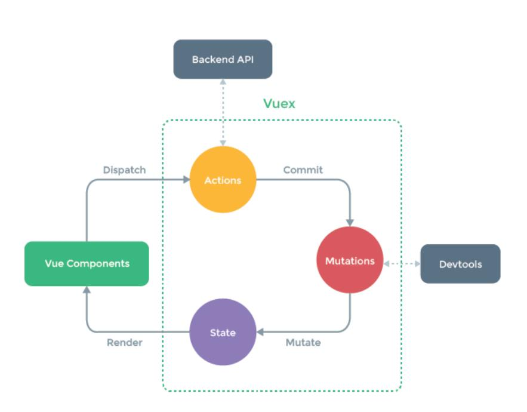

# 本次Vue项目分为前台和后台管理系统

前台项目 vue webpack vuex vue-router axios less
后台管理系统 vue webpack vuex vue-router axios less  element-ui

# Vue-cli脚手架初始化项目

需要条件：node+webpack+淘宝镜像
创建项目  vue create xxxx

# 文件夹含义

node_modules:项目依赖
public：一般放静态资源  webpack打包的时候会打包到dist中
src：代码文件夹
    assets:一般是放置静态资源（组件共用的静态资源） webpack打包时会打包到js文件里
    component：放置非路由组件（全局路由）
    App.vue:唯一的根组件  （.vue）
    main.js:程序的入口文件  最先执行文件
package.json:项目依赖
babel.config.js:与babel相关的

# 项目其他配置

1 项目运行  浏览器自动打开
---package.json中：
        "scripts": {
        "serve": "vue-cli-service serve --open",
        "build": "vue-cli-service build",
        "lint": "vue-cli-service lint"
    },
--- vue.config.js中：
    devServer:{
        open:true,
        host:'localhost',
        port:8080,
    }
2 eslint校验功能关闭
--- vue.config.js中：
    lintOnSave:false

3 src文件夹简写方法  配置别名  @  写路径的时候用@符号来代表src
--- jsconfig.js中：
    {
        "compilerOptions": {
            "baseUrl": "./",
            "paths": {
            "@/*": [
                "src/*"
            ]
            },
        },

        "exclude": [
            "node_modules",
            "dist"
        ]
    }

# 项目路由  Vue-router  

前端所谓路由：key-value键值对   key：URL  value：相应的路由组件
路由组件：home页组件  search页组件  login组件  register组件
非路由组件  ：header（四个中都有）  footer（在home search中存在）

# 先创建非路由组件

开发项目的时候：
1 书写静态页面  html css
2 拆分组件
3 获取服务器的数据动态展示
4 完成相应的动态业务逻辑

# 创建组件注意事项

1 创建组件要有组件结构 组件的样式 图片资源
2 项目采用less样式时需要下载less less-loader依赖
3 识别less样式时style标签中需要有lang='less'

# 使用组件的步骤（非路由组件）

1 创建|定义组件
2 引入
3 注册
4 使用

# 路由组件的搭建

 component 一般放非路由组件
 pages | views 一般放路由组件

# 配置路由

 1 放在router文件夹
  1.1 router文件夹要进行引入 Vue 和 Vue-router
  1.2 使用router插件 Vue.use(VueRouter);
  1.3 导入各个路由组件
  1.4 配置路由即可
 2 在router文件夹写好相关路由  向外暴露  然后在入口文件夹进行引入

# 路由组件与非路由组件的区别

1 路由组件放pages|views文件夹   非路由组件一般在component文件夹
2 路由组件一般需要在router文件夹中注册  非路由组件一般以标签的形式注册
3 main.js中写router时，组件身上会有$route,$router属性
  $route：一般获取路由信息（路径 query params meta）
  $router:一般进行编程式导航进行路由跳转（push | replace）
4 注册完路由 无论是那个路由 都有$route,$router属性

# 路由跳转

两种形式
    声明式导航router-link （要有to属性）
    编程式导航 利用$router.push|replace方法
编程式导航:声明式导航能做的，编程式导航都能做；但编程式导航除了可以进行路由跳转 还可以做一些其他的业务逻辑

# 编程式路由跳转到当前路由  多次执行会出现NavigationDuplicated的警告错误

1 原因：最新的vue-route引入了promise  
2 解决办法：promise需要传递resolve和reject的回调  这样才会处理异常  没有传递的话就会产生警告 但是没有根治
3 push方法是vue-router原型下面的方法  $route是VueRouter下面的属性 就可以访问到原型上面的方法
4 若要根治  就需要重写push方法  调用时分情况
  如果传递的参数含有回调  则直接调用原有的push  
  若没有 则传递回调参数即可

# 路由传参  在路由跳转的时候需要传递参数  例如搜索页面  需要将查询的信息传递给搜索页面

1 params:属于路径当中的一部分 在配置路由的时候  需要占位
在要跳转的页面进行占位 要跳转进那个页面就在那个页面进行占位 /home/:xxx/:xxxx
跳转的页面需要接收的时候就是通过$route.params.id来获取
    两种写法：
    (1)字符串写法：<route-link :to="`/home/${xxx}/${xx}/${xxxx}`"></route-link>   xx代表要传递的参数
    (2)对象写法：:to="{
        path:要跳转的页面,
        params:{
            要传递的参数
        }
    }"
2 query ：不属于路径当中的一部分  类似于Ajax中的querystring  不需要占位  
跳转的页面需要接收的时候就是通过$route.query.id来获取
   两种写法：
    (1)字符串写法：在要跳转的路径后面写？+ 要传递的参数  例如 :to=`"/home/?id=${xxx}&title=${xxxx}"`
    (2)对象写法：:to="{
        path:要跳转的页面,
        query:{
            要传递的参数
        }
    }"

# 路由传参的面试题

1 对象写法时  path是否可以和params参数一起使用？
    不可以  只能给路由起个别名和params一起使用  但是对象写法里面可以有path属性但不可和params一起使用
2 如何指定params参数可传可不传 在占位时在后面加上?  就代表可加可不加
    配置路由时占位了  但是路由传参时没有传递  那么路径会出问题
3 params传递参数时如果是空串  如何解决
    这时候路径存在问题  使用undefined解决  params:{keyword ='' || unde}
4 路由组件能不能传递props数据
    可以

# 路由中的props 在路由中处理好  这样取值方便

三种写法：
1 对象写法 该对象中的所有key-value都会以props的形式传递给所在的组件
    props:{a:1,b:'hello'}
    在所在组件中声明props:['a','b']  调用是直接插值语句即可
2 布尔值  若布尔值为真，就会把该路由收到的所有params参数以props形式传给所在组件
    props:true
    在所在组件中声明props:[params的参数]  调用是直接插值语句即可
3 值为函数  该对象中的所有key-value都会以props的形式传递给所在的组件
    props($route){
        return {写要传递的参数  id:$route.query.id}
    }
    在所在组件中声明props:['id']  调用是直接插值语句即可

# footer组件的显示与隐藏

1 对于footer来说  只有home和search页面才有  所以在footer标签中需要用v-show|v-if来控制组件的显示隐藏
2 一般会用v-show 因为v-if会频繁操作dom 消耗性能
3 但是一般不用$route.path来控制显示隐藏，一般采用路由元信息meta来控制
4 配置路由信息的时候  要注意路由的属性 都是固定属性  不能乱写

# 拆分组件的时候注意 要是一个组件在很多组件中都会被引用的话  声明为全局组件  在项目的任意地方都可以使用

# home组件进行拆分  拆分成七个小组件  

# axios发送请求  src文件夹下建立api文件夹  一般存放axios请求

request.js  重写axios请求
index.js  统一管理api

# 向服务器发请求  传递数据

# 刚开始发送请求时出现404  存在跨域问题（域名 协议 端口号不同请求）  服务器地址不一样

<http://localhost:8080/#/home>（本地服务器）向 <http://39.98.123.211> 服务器发送请求请求数据  存在跨域

解决跨域：CROS JSONP 代理

代理服务器：proxy  代理服务器他会向真正的服务器请求数据  看到api就会工作   target中存放真正的服务器 写在配置文件中
    proxy: {
        <!-- api写什么都行 -->
      '/api': {
        target: 'http://39.98.123.211',
      },
    }

# nprogress进度条的插件  在项目请求的时候会产生进度  先下载安装进度条  还要引入进度条以及样式

nprogress下面有start（进度条开始）  done（进度条结束）
发送请求的时候开始进度条  返回数据成功后结束进度条  

# vuex 状态管理库

1 是什么  是官方提供的插件  状态管理库  集中式管理项目汇中共用的数据
注意 并不是所有数据都需要vuex 项目小的话不需要  项目大的话维护数据比较困难需要用vuex
2 state 存储数据
mutations 修改states的位移手段
actions 处理action 书写自己逻辑  处理异步
getters  计算属性  简化仓库数组  让组件获取仓库的数据更加方便
3 vuex实现模块式开发 数据过多的话可以进行拆分  将大store拆分成小store
4 使用时需要将其挂载在vue.prototype下面

# vuex原理图

三个重要组成部分：actions mutation state（状态即数据 object对象）
组件里面调用api是通过dispath来调用actions里面的方法，在actions里面提交commit到mutation来修改state，actions里面是不允许修改state
commit里面的参数（state，传递的参数），state是固定的，会获取到所有state

mapstate：映射状态  借助他来生成计算属性，从state中读取数据
对象写法：右侧是一个函数,当使用的时候会调用一次,参数注入一个state,就是大仓库中的数据
    ...mapstate(
        对象名:(state)=>{
            xxxxxx
        }
    })

# 三级联动动态展示背景颜色

1 采用样式  :hover
2 采用js(记录当前的index  当索引相等时就添加样式)

# 三级联动中二三级分类的显示与隐藏

最开始通过display来控制显示与隐藏，现在通过JS来控制(当前鼠标滑入的currentindex == index 就显示二级三级)

# 三级联动鼠标滑入卡顿现象

用户操作过快导致浏览器无法反应 引出函数的防抖与节流

# 函数防抖

前面所有触发都会取消，最后一次触发在规定时间后才会执行，即多次连续的触发  只会有一次生效

# 函数节流

规定的时间内不会重复触发回调  只有大于时间间隔才会触发回调

# 三级联动的节流操作

采用lodash中封装的函数  比如防抖节流 去重

# 三级联动路由跳转以及传参

用户可以点击二三级分类进行跳转  从home页面跳转到search页面
点击的时候一级分类会将用户选中的产品在路由跳转的时候作为参数传递过去
采用编程式导航+事件委派进行路由跳转  （事件委派的原因：防止组件过多导致卡顿  将其委派给父元素进行跳转）

具体思路：给a标签加上自定义属性来记录name和id 利用event.target来获取节点  通过dataset属性将name和对应id解构出来  
进而判断是几级分类 不同级别的分类id参数不一样  因此传递参数的时候需要进行判断

# serach页面中三级联动

传递参数时要传递两个参数  一个是typenav的query  一个是搜索的params

# mock模拟数据 不会真正像服务器发送请求  就是前端试验数据

1 使用步骤
1)下载依赖 npm i mockjs
2)项目中src文件下面创建mock文件夹
3)模拟数据 准备JSON数据  mock中需要的图片放到public中
4)在mock文件夹中创建一个mockServe.js文件
  这里可以直接使用JSON数据（没有对外暴露的JSON数据）对于webpack当中一些模块：图片、json，不需要对外暴露，因为默认就是对外暴露。
5)开始mock数据 通过Mock.mock方法进行模拟数据
6)mockServe.js在入口文件引入
7)在API文件夹中创建mockRequest【axios实例：baseURL:'/mock'】,专门获取模拟数据用的axios实例。

# swiper 插件轮播图 PC端  移动端

使用步骤
1 引包  js|css
2 页面html结构要有
3 初始化实例 new Swiper()（一定要在组件实例都加载完才可以new Swiper添加动态效果）

本项目中采用watch + nextTick来解决轮播图
1 只采用watch不能解决的原因：watch中的函数只是保证数据已经获取到，但是v-for是否执行完毕不得而知，只有当v-for执行完毕才可以将修改后的数据放到dom上，才有结构，swiper才可以new
2 nextTick：在下次DOM更新循环结束之后执行延迟回调。修改数据后立即使用这个方法，获取更新后的dom即页面中的所有结构已经存在在进行下面的操作（当v-for循环执行完毕后数据已经更新后才进行获取  这时候获取的结构已经是带有所有更新数据后的结构）

1 静态数据
2 写接口请求数据
3 mounted发请求获取
4 vuex  action  mutation state是固定的

# floor组件获取mock数据

home：父组件  floor：子组件
1 需要在home里面的index.vue进行发请求获取floor组件数据  这样才v-for遍历组件进行复用
2 home组件获取到floor组件的数据，循环产生两个floor，再利用父子组件之间的通信将home（父组件）的数据传递给floor（子组件）进行使用
3 父给子传递数据：利用props  在home组件中引入floor组件的地方动态绑定一个数据，在floor组件中利用props进行接收（props:['数据名']）

组件通信的方式
1 props 父子组件通信
2 自定义事件：$on $emit 子给父通信
3 $bus 全局事件总线  全能
4 插槽
5 vuex

# search模块

先写静态页面
拆分组件
获取数据（vuex三连环  action mutation state）
将数据显示在页面上

# search页面根据参数获取到相应数据显示页面

1 向服务器发送请求的时候要带上用户search的数据，要将home页面跳转search页面传递的参数与search本身的参数进行合并，发送请求的时候携带过去 
2 从服务器获取到相应search的数据展示出来
3 发送请求的次数是多次的，所以要采用watch监听路由的变化。当用户发起search请求的时候，监听$route的变化，一旦发生改变，就获取用户要search的参数，根据参数进行发起请求来获取数据进行页面展示

# 动态开发search页面面包屑导航

1 分类字：删除面包屑的时候需要跳转回search初始页面 记得携带相应参数
2 关键字：与删除分类字一样，但是要注意这里要在search组件中删除header组件中的内容（用$bus来实现  $emit  $on）

# 面包屑处理品牌信息  点击品牌的时候显示信息

1 search：父组件  SearchSelector：子组件
2 步骤：SearchSelector组件中点击品牌信息进行显示，这时候就需要SearchSelector组件将点击的品牌信息传递给search组件，search组件接收到信息后发起请求进行数据显示
3 SearchSelector组件传递信息给search组件（子给父传递）：采用自定义事件，在父组件中引用子组件的地方自定义一个事件XXX，在子组件中点击品牌时触发该事件并将参数传递过去（this.$emit('XXX',参数)，子组件中点击的时候会触发父组件的XXX事件并将参数一并传递过去）
